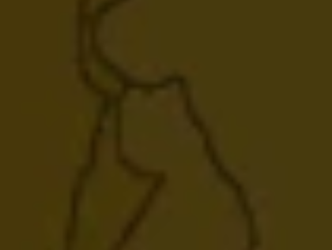
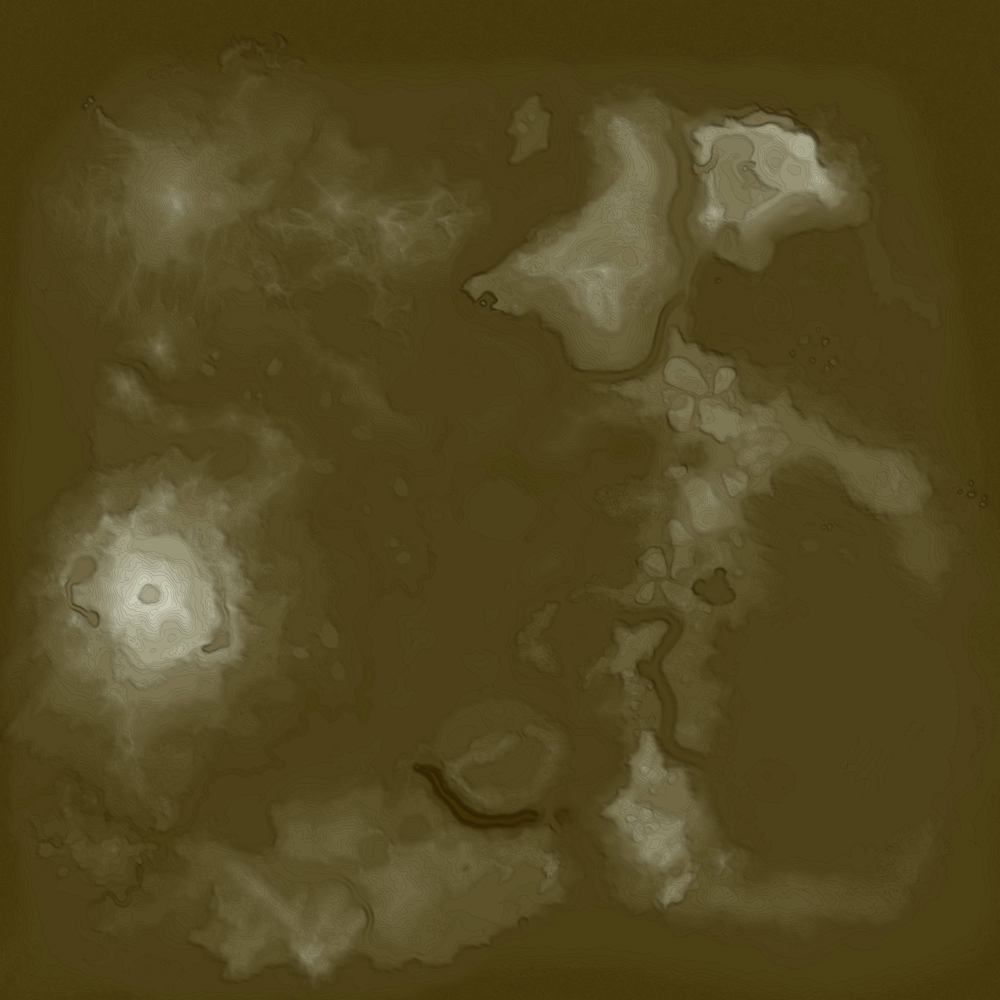
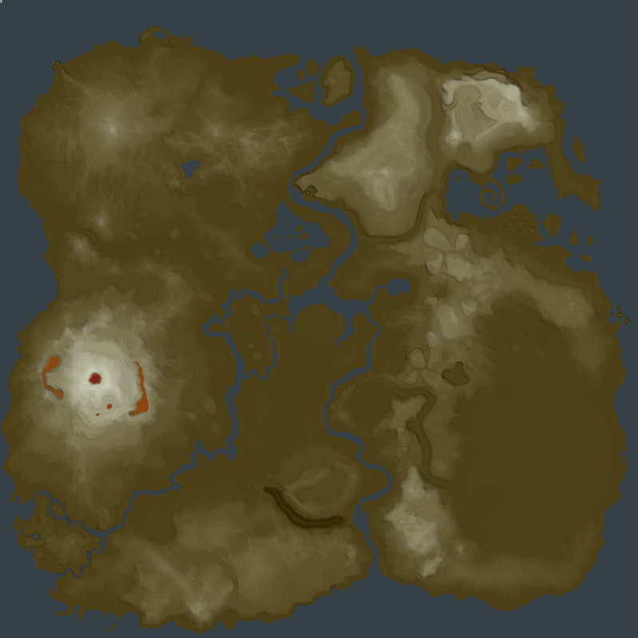

# tiff_to_botw_heightmap

How to use: python convert.py <input.tiff> <output.png> [steps] [log_strenght] [outlines_true_false]

On linux of course use python3...

You`ll have to put in the whole path in input / output

Steps means to how many Layers will your map be splitted

The log strengt is a feature that allows yoou to bundle more Layers in upper or lower heights put in 0 if you wnt the height-distribution to be linear.

Outlined activates these outlines:

My best personal result:

After (manually by ENORME) adiing Rivers/Stuff:

